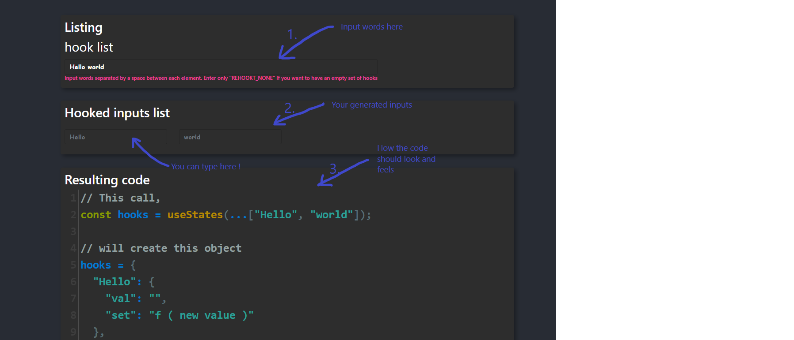

# Demo version

## install
Once you cloned Rehookt, keep only the demo folder.
open a terminal into the `demo` folder. And run:
```bash
$ npm install
```

## Run it
```bash
# will provide the local web page on http://localhost:3000
$ npm run start
```

## Have fun

With this demo you will be able to analyse behaviors upon generating hooks. If something is wrong you will be hinted by an error box. Or if not, you will see what hooks is resulted from your inputs. 

### how it works
1. **Input words** in the first field. The page will refresh after you finished typing.
1. **Now enter text in generated fields**. These fileds are hooked dynamically **rehookt allows you to do that !** - creating hooks on the fly!
1. **Observe the result**. The demo shows you what type of object you will get from the call to rehookt so you have an idea how to get your hands on more easyly.

Open this already inputed [page](http://localhost:3000/?redirect=%2F%3F%26listing%3DHello%20world) into the browser or perform the same *with style* from the terminal.

```bash
# [Windows]
$ start http://localhost:3000/?redirect=%2F%3F%26listing%3DHello%20world

# [Unix]
$ xdg-open http://localhost:3000/?redirect=%2F%3F%26listing%3DHello%20world

# [Mac]
$ open http://localhost:3000/?redirect=%2F%3F%26listing%3DHello%20world
```


## First try

You may encounter a tiny problem. Since the application works on query parameters, it has to compute that one based on your input... if it seems not working on the first try, just retry typing.
